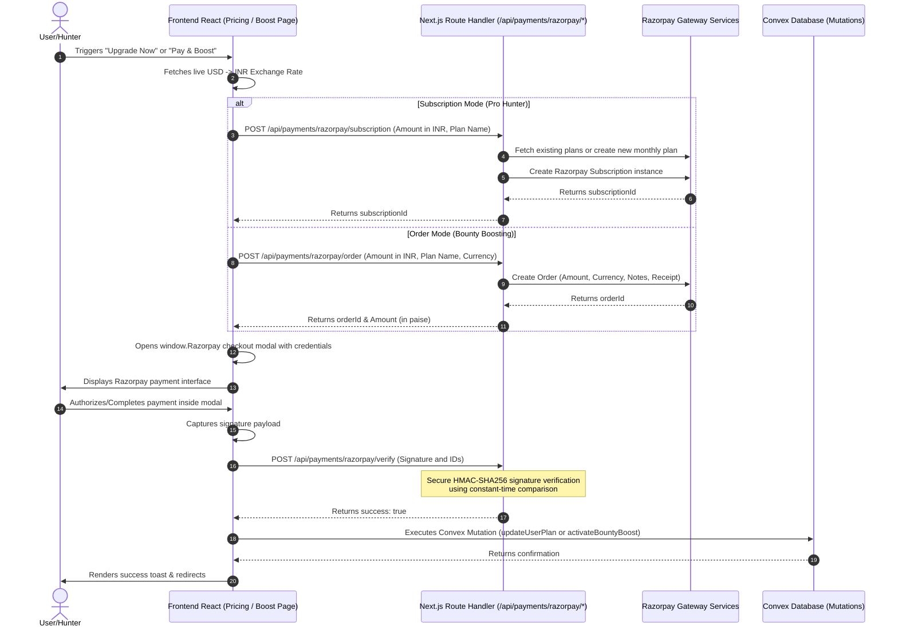

# 💳 Bounty Monster - Razorpay Payment System Flow & Codebase Documentation

This document provides a comprehensive, end-to-end breakdown of the **Razorpay Payment System** integrated into the Bounty Monster platform. It details the complete logic flow, database schemas, API routes, and client-side hooks/components with the exact code lines.

---

## 🛠️ High-Level System Architecture & Flow

The system supports two distinct payment flows using the Razorpay SDK:
1. **One-Time Payments (Orders):** Used for **Bounty Boosting** (boosting user bounties to featured status for $3/day in INR equivalent).
2. **Recurring Payments (Subscriptions):** Used for upgrading users to premium tiers like **Pro Hunter** ($6/month in INR equivalent).

### Payment Flow Diagram



---

## 🗄️ 1. Database Schema & Convex Mutations

Payments are finalized in the **Convex** backend. The database tracks subscription IDs for clean lifecycle handling (such as immediate cancels upon downgrade) and timestamps/flags for boosted bounties.

### A. Database Schema definition
Location: [convex/schema.ts](file:///c:/Users/Ritesh%20Sinha/OneDrive/Desktop/bounty-monster/convex/schema.ts)
```typescript
import { defineSchema, defineTable } from "convex/server";
import { v } from "convex/values";

export default defineSchema({
  users: defineTable({
    clerkToken: v.string(),
    name: v.optional(v.string()), // Used as the primary username
    email: v.string(),
    userAvatar: v.optional(v.string()),
    userType: v.union(v.literal("user"), v.literal("admin")),
    planType: v.union(v.literal("free"), v.literal("pro"), v.literal("elite")),
    razorpaySubscriptionId: v.optional(v.string()), // stored on Pro subscription, cleared on cancel
    socialLinks: v.optional(
      v.array(
        v.object({
          platform: v.string(),
          url: v.string(),
        }),
      ),
    ),
    phoneNumber: v.optional(v.string()),
    onBoarding: v.boolean(),
    streaks: v.optional(v.number()),
    mainMoto: v.optional(v.string()),
    createdAT: v.number(),
    updatedAT: v.number(),
    // newly added....
    xp: v.optional(v.number()),
    level: v.number(),
  }).index("by_token", ["clerkToken"]),

  // -----------------------------------------------------
  bounties: defineTable({
    creatorId: v.id("users"),
    name: v.string(),
    description: v.string(),
    reward: v.number(),
    maxHunters: v.optional(v.number()),
    rewardPerHunter: v.optional(v.number()),
    type: v.string(), // Extensible typing system (e.g. tech, event)
    coverImage: v.string(),
    xpReward: v.number(),
    requirementLevel: v.number(),
    status: v.union(
      v.literal("active"),
      v.literal("draft"),
      v.literal("completed"),
    ),
    tasks: v.array(
      v.object({
        name: v.string(),
        description: v.string(),
        url: v.optional(v.string()),
        xp: v.number(),
      }),
    ),
    createdAt: v.number(),
    deadline: v.number(),
    updatedAt: v.number(),
    editedAt: v.optional(v.number()),
    isBoosted: v.optional(v.boolean()),
    boostStartedAt: v.optional(v.number()),
    boostEndsAt: v.optional(v.number()),
  }).index("by_creatorId", ["creatorId"]),

  bountyParticipants: defineTable({
    bountyId: v.id("bounties"),
    userId: v.id("users"),
    joinedAt: v.number(),
    status: v.union(
      v.literal("active"),
      v.literal("left"),
      v.literal("submitted"),
      v.literal("completed"),
    ),
    leftAt: v.optional(v.number()),
  })
    .index("by_bountyId", ["bountyId"])
    .index("by_userId", ["userId"])
    .index("by_bountyId_userId", ["bountyId", "userId"]),

  questSubmissions: defineTable({
    bountyId: v.id("bounties"),
    userId: v.id("users"),
    taskIndex: v.number(),
    proofUrls: v.array(v.string()),
    note: v.optional(v.string()),
    submittedAt: v.number(),
    resolvedAt: v.optional(v.number()),
    status: v.union(
      v.literal("pending"),
      v.literal("approved"),
      v.literal("rejected"),
    ),
  })
    .index("by_bountyId", ["bountyId"])
    .index("by_userId", ["userId"])
    .index("by_bountyId_userId", ["bountyId", "userId"])
    .index("by_bountyId_userId_taskIndex", ["bountyId", "userId", "taskIndex"]),

  notifications: defineTable({
    userId: v.id("users"),
    type: v.string(),
    title: v.string(),
    body: v.string(),
    link: v.optional(v.string()),
    read: v.boolean(),
    createdAt: v.number(),
  }).index("by_userId", ["userId"]),

  dailyLogins: defineTable({
    userId: v.id("users"),
    dateString: v.string(), // e.g., "2026-03-29"
    timestamp: v.number(),
  })
    .index("by_userId", ["userId"])
    .index("by_userId_date", ["userId", "dateString"]),

  huntBonusClaims: defineTable({
    userId: v.id("users"),
    milestoneKey: v.string(),
    xpAwarded: v.number(),
    claimedAt: v.number(),
  })
    .index("by_userId", ["userId"])
    .index("by_userId_milestone", ["userId", "milestoneKey"]),

  searchHistory: defineTable({
    userId: v.id("users"),
    query: v.string(),
    createdAt: v.number(),
  }).index("by_userId", ["userId"]),
});
```

### B. User Plan Update Mutation
Location: [convex/payments.ts](file:///c:/Users/Ritesh%20Sinha/OneDrive/Desktop/bounty-monster/convex/payments.ts)
```typescript
import { v } from "convex/values";
import { mutation } from "./_generated/server";

export const updateUserPlan = mutation({
  args: {
    planType: v.union(v.literal("free"), v.literal("pro"), v.literal("elite")),
    subscriptionId: v.optional(v.string()), // pass on Pro upgrade; omit or pass undefined to clear
  },
  handler: async (ctx, args) => {
    const identity = await ctx.auth.getUserIdentity();
    if (!identity) {
      throw new Error("Unauthorized");
    }

    // Look up user by Clerk token — clerkToken is indexed for fast lookup (see schema.ts)
    const user = await ctx.db
      .query("users")
      .withIndex("by_token", (q) =>
        q.eq("clerkToken", identity.tokenIdentifier),
      )
      .unique();

    if (!user) {
      throw new Error("User not found");
    }

    await ctx.db.patch(user._id, {
      planType: args.planType,
      razorpaySubscriptionId: args.subscriptionId ?? undefined,
      updatedAT: Date.now(), // NOTE: typo — should be updatedAt, fix in schema.ts + all references together
    });

    return { success: true };
  },
});
```

### C. Bounty Boost Mutation
Location: [convex/bounties.ts](file:///c:/Users/Ritesh%20Sinha/OneDrive/Desktop/bounty-monster/convex/bounties.ts) (showing lines related to Boost activation)
```typescript
/**
 * Activates boost on a bounty after successful payment verification.
 * Called from the client after the existing /api/payments/razorpay/verify route confirms the signature.
 */
export const activateBountyBoost = mutation({
  args: {
    bountyId: v.id("bounties"),
    days: v.number(),
    startDate: v.number(),
  },
  handler: async (ctx, args) => {
    const identity = await ctx.auth.getUserIdentity();
    if (!identity) throw new Error("Unauthorized");

    const user = await ctx.db
      .query("users")
      .withIndex("by_token", (q) =>
        q.eq("clerkToken", identity.tokenIdentifier),
      )
      .unique();
    if (!user) throw new Error("User not found");

    const bounty = await ctx.db.get(args.bountyId);
    if (!bounty) throw new Error("Bounty not found");
    if (bounty.creatorId !== user._id) throw new Error("Not the creator");

    const boostEndsAt = args.startDate + args.days * 24 * 60 * 60 * 1000;

    await ctx.db.patch(args.bountyId, {
      isBoosted: true,
      boostStartedAt: args.startDate,
      boostEndsAt,
      updatedAt: Date.now(),
    });

    return { success: true };
  },
});
```

---

## 🌐 2. Server-Side Next.js API Routes

These API endpoints are deployed as server-side Next.js route handlers under `src/app/api/payments/razorpay/`. They communicate securely with the Razorpay platform.

### A. One-Time Order Creator
Creates an order instance on Razorpay. It fails fast if credentials are not set and receives amount in decimals (USD or standard INR units), converting it to the smallest unit (paise) required by Razorpay.

Location: [src/app/api/payments/razorpay/order/route.ts](file:///c:/Users/Ritesh%20Sinha/OneDrive/Desktop/bounty-monster/src/app/api/payments/razorpay/order/route.ts)
```typescript
import { auth } from "@clerk/nextjs/server";
import { type NextRequest, NextResponse } from "next/server";
import Razorpay from "razorpay";

/**
 * Fail fast at startup if credentials are missing
 */
if (
  !process.env.NEXT_PUBLIC_RAZORPAY_KEY_ID ||
  !process.env.RAZORPAY_KEY_SECRET
) {
  throw new Error(
    "[Razorpay] Missing NEXT_PUBLIC_RAZORPAY_KEY_ID or RAZORPAY_KEY_SECRET in env",
  );
}

const razorpayKeyId = process.env.NEXT_PUBLIC_RAZORPAY_KEY_ID;
const razorpayKeySecret = process.env.RAZORPAY_KEY_SECRET;

/**
 * Module-level singleton — safe to reuse across requests
 */
const razorpay = new Razorpay({
  key_id: razorpayKeyId,
  key_secret: razorpayKeySecret,
});

/**
 * Razorpay requires amounts in the smallest currency unit (paise for INR)
 */
const PAISA_MULTIPLIER = 100;

/**
 * Creates a new Razorpay order for one-time payments.
 * Ensures the user is authenticated and the amount is valid.
 */

export async function POST(req: NextRequest) {
  try {
    const { amount, currency = "INR", planName } = await req.json();

    const { userId } = await auth();
    if (!userId) {
      return NextResponse.json({ error: "Unauthorized" }, { status: 401 });
    }

    if (!amount || typeof amount !== "number" || amount <= 0) {
      return NextResponse.json(
        { error: "amount is required and must be a positive number" },
        { status: 400 },
      );
    }

    const order = await razorpay.orders.create({
      amount: Math.round(amount * PAISA_MULTIPLIER),
      currency,
      receipt: `rcpt_${Date.now()}_${Math.random().toString(36).slice(2, 8)}`,
      notes: {
        userId, // Clerk user ID — use this in webhooks to find the right user
        planName: planName || "unknown",
      },
    });

    return NextResponse.json({
      orderId: order.id,
      amount: order.amount, // in paise
      currency: order.currency,
    });
  } catch (error) {
    const message = error instanceof Error ? error.message : String(error);
    console.error("[Razorpay Order]", message);
    return NextResponse.json(
      { error: "Failed to create order" },
      { status: 500 },
    );
  }
}
```

### B. Recurring Subscription Creator
Subscribes the user to a monthly recurring billing plan. Idempotently searches for an existing plan in the merchant dashboard with a matching amount, creating a plan only if none exists, preventing catalog fragmentation.

Location: [src/app/api/payments/razorpay/subscription/route.ts](file:///c:/Users/Ritesh%20Sinha/OneDrive/Desktop/bounty-monster/src/app/api/payments/razorpay/subscription/route.ts)
```typescript
import { type NextRequest, NextResponse } from "next/server";
import Razorpay from "razorpay";

/**
 * Fail fast at startup if credentials are missing
 */
if (
  !process.env.NEXT_PUBLIC_RAZORPAY_KEY_ID ||
  !process.env.RAZORPAY_KEY_SECRET
) {
  throw new Error(
    "[Razorpay] Missing NEXT_PUBLIC_RAZORPAY_KEY_ID or RAZORPAY_KEY_SECRET in env",
  );
}

const razorpayKeyId = process.env.NEXT_PUBLIC_RAZORPAY_KEY_ID;
const razorpayKeySecret = process.env.RAZORPAY_KEY_SECRET;

type RazorpayPlan = {
  id: string;
  period: string;
  item: {
    amount: number | string;
  };
};

/**
 * Module-level singleton — safe to reuse across requests
 */
const razorpay = new Razorpay({
  key_id: razorpayKeyId,
  key_secret: razorpayKeySecret,
});

/**
 * Creates a new Razorpay subscription (recurring payment).
 * Idempotently searches for an existing plan or creates a new one to prevent duplication.
 */
export async function POST(req: NextRequest) {
  try {
    const { amount, planName, currency = "INR" } = await req.json();

    if (!amount || typeof amount !== "number" || amount <= 0) {
      return NextResponse.json(
        { error: "amount is required and must be a positive number" },
        { status: 400 },
      );
    }

    const amountInPaise = Math.round(amount * 100); // Razorpay expects paise

    /**
     * Fetch existing plans and reuse a matching one to avoid duplicates in the dashboard.
     * NOTE: plans.all() returns up to 10 by default — using { count: 100 } handles larger catalogs.
     */
    const plans = await razorpay.plans.all({ count: 100 });
    const existingPlan = (plans.items as RazorpayPlan[]).find(
      (p) => Number(p.item.amount) === amountInPaise && p.period === "monthly",
    );

    const targetPlan =
      existingPlan ??
      (await razorpay.plans.create({
        period: "monthly",
        interval: 1,
        item: {
          name: planName || "Pro Hunter",
          amount: amountInPaise,
          currency,
          description: `Monthly subscription for ${planName || "Pro Hunter"}`,
        },
      }));

    /**
     * total_count = 12 means the subscription auto-expires after 12 billing cycles (1 year)
     * Set to 0 for indefinite — but explicit counts prevent zombie subscriptions from lingering forever.
     */
    const subscription = await razorpay.subscriptions.create({
      plan_id: targetPlan.id,
      total_count: 12,
      quantity: 1,
      customer_notify: 1,
    });

    return NextResponse.json({
      subscriptionId: subscription.id,
      amount,
      currency,
    });
  } catch (error) {
    const message = error instanceof Error ? error.message : String(error);
    console.error("[Razorpay Subscription]", message);
    return NextResponse.json(
      { error: message || "Failed to create subscription" },
      { status: 500 },
    );
  }
}
```

### C. Secure Signature Verifier
Performs verification of Razorpay checkouts. Calculates expected SHA-256 signatures depending on whether it is an `order_id` or `subscription_id` parameter layout. Protects against timing attacks using constant-time comparison via NodeJS buffer equivalence.

Location: [src/app/api/payments/razorpay/verify/route.ts](file:///c:/Users/Ritesh%20Sinha/OneDrive/Desktop/bounty-monster/src/app/api/payments/razorpay/verify/route.ts)
```typescript
import crypto from "node:crypto";
import { type NextRequest, NextResponse } from "next/server";

function getRazorpayKeySecret() {
  const secret = process.env.RAZORPAY_KEY_SECRET;
  if (!secret) {
    throw new Error("[Razorpay] Missing RAZORPAY_KEY_SECRET in env");
  }
  return secret;
}

/**
 * Verifies Razorpay webhook signatures securely.
 * Handles both one-time order payments and recurring subscription payments.
 */
export async function POST(req: NextRequest) {
  try {
    const {
      razorpay_order_id,
      razorpay_subscription_id,
      razorpay_payment_id,
      razorpay_signature,
    } = await req.json();

    if (!razorpay_payment_id || !razorpay_signature) {
      return NextResponse.json(
        { error: "payment_id and signature are required" },
        { status: 400 },
      );
    }

    /**
     * Determines the signature composition order.
     * Order signature mapping:        "order_id|payment_id"
     * Subscription signature mapping: "payment_id|subscription_id"
     */
    let body = "";
    if (razorpay_order_id) {
      body = `${razorpay_order_id}|${razorpay_payment_id}`;
    } else if (razorpay_subscription_id) {
      body = `${razorpay_payment_id}|${razorpay_subscription_id}`;
    } else {
      return NextResponse.json(
        { error: "Missing razorpay_order_id or razorpay_subscription_id" },
        { status: 400 },
      );
    }

    const expectedSignature = crypto
      .createHmac("sha256", getRazorpayKeySecret())
      .update(body)
      .digest("hex");

    /**
     * Executes a constant-time comparison of the computed vs received signatures.
     * This protects against timing attacks where attackers guess the key based on response time.
     */
    const isValid = crypto.timingSafeEqual(
      Buffer.from(expectedSignature),
      Buffer.from(razorpay_signature),
    );

    if (!isValid) {
      return NextResponse.json(
        { success: false, message: "Invalid signature" },
        { status: 400 },
      );
    }

    /**
     * WARNING: Currently plan update happens client-side via Convex mutation after this returns.
     * For high production safety, implement server-side DB plan updates exactly here.
     */

    return NextResponse.json({
      success: true,
      message: "Payment verified successfully",
    });
  } catch (error) {
    const message = error instanceof Error ? error.message : String(error);
    console.error("[Razorpay Verify]", message);
    return NextResponse.json(
      { error: "Failed to verify payment" },
      { status: 500 },
    );
  }
}
```

### D. Subscription Canceller
Programmatically cancels the active recurring subscription, allowing optional immediate cancellation.

Location: [src/app/api/payments/razorpay/cancel/route.ts](file:///c:/Users/Ritesh%20Sinha/OneDrive/Desktop/bounty-monster/src/app/api/payments/razorpay/cancel/route.ts)
```typescript
import { type NextRequest, NextResponse } from "next/server";
import Razorpay from "razorpay";

/**
 * Fail fast at startup if credentials are missing
 */
if (
  !process.env.NEXT_PUBLIC_RAZORPAY_KEY_ID ||
  !process.env.RAZORPAY_KEY_SECRET
) {
  throw new Error(
    "[Razorpay] Missing NEXT_PUBLIC_RAZORPAY_KEY_ID or RAZORPAY_KEY_SECRET in env",
  );
}

const razorpayKeyId = process.env.NEXT_PUBLIC_RAZORPAY_KEY_ID;
const razorpayKeySecret = process.env.RAZORPAY_KEY_SECRET;

/**
 * Module-level singleton — safe to reuse across requests
 */
const razorpay = new Razorpay({
  key_id: razorpayKeyId,
  key_secret: razorpayKeySecret,
});

/**
 * Cancels an active Razorpay subscription.
 * Receives the subscription ID from the client and terminates the cycle immediately.
 */
export async function POST(req: NextRequest) {
  try {
    const { subscriptionId } = await req.json();

    if (!subscriptionId) {
      return NextResponse.json(
        { error: "subscriptionId is required" },
        { status: 400 },
      );
    }

    /**
     * cancel_at_cycle_end: false means cancel immediately.
     * The user loses access exactly when this executes, rather than at the end of the billing period.
     */
    await razorpay.subscriptions.cancel(subscriptionId, false);

    return NextResponse.json({ success: true });
  } catch (error) {
    const message = error instanceof Error ? error.message : String(error);
    console.error("[Razorpay Cancel]", message);
    return NextResponse.json(
      { error: message || "Failed to cancel subscription" },
      { status: 500 },
    );
  }
}
```

---

## 💻 3. Client-Side Hooks & React Components

### A. Custom Payment Hook (`useRazorpay`)
Manages standard currency conversions dynamically through a public API, loads target parameters depending on whether standard order parameters or subscription IDs are parsed, handles the modal closure triggers, and launches signature validations.

Location: [src/modules/subscription/hooks/useRazorpay.ts](file:///c:/Users/Ritesh%20Sinha/OneDrive/Desktop/bounty-monster/src/modules/subscription/hooks/useRazorpay.ts)
```typescript
"use client";

import { useUser } from "@clerk/nextjs";
import { useMutation } from "convex/react";
import { useRouter } from "next/navigation";
import { useEffect, useState } from "react";
import { toast } from "sonner";
import { api } from "../../../../convex/_generated/api";

export type RazorpayPaymentResponse = {
  razorpay_order_id?: string;
  razorpay_subscription_id?: string;
  razorpay_payment_id: string;
  razorpay_signature: string;
};

export type RazorpayPaymentFailedResponse = {
  error: {
    description: string;
  };
};

type RazorpayCheckoutOptions = {
  key: string | undefined;
  amount?: number;
  currency?: string;
  order_id?: string;
  subscription_id?: string;
  name: string;
  image: string;
  description: string;
  handler: (response: RazorpayPaymentResponse) => Promise<void>;
  prefill: {
    name: string;
    email: string;
  };
  theme: {
    color: string;
  };
  modal: {
    ondismiss: () => void;
  };
};

type RazorpayInstance = {
  on: (
    event: "payment.failed",
    callback: (response: RazorpayPaymentFailedResponse) => void,
  ) => void;
  open: () => void;
};

declare global {
  interface Window {
    Razorpay: new (options: RazorpayCheckoutOptions) => RazorpayInstance;
  }
}

export type PlanType = "pro" | "elite" | null;

export interface Plan {
  name: string;
  planType: PlanType;
  priceUSD: number;
}

export const useRazorpay = () => {
  const { user } = useUser();
  const [loadingPlan, setLoadingPlan] = useState<string | null>(null);
  const [exchangeRate, setExchangeRate] = useState(85); // fallback if fetch fails
  const updateUserPlan = useMutation(api.payments.updateUserPlan);
  const router = useRouter();

  /**
   * Fetch live USD→INR rate on mount.
   * Falls back to hardcoded 85 if API is down to prevent payment blocks.
   */
  useEffect(() => {
    const fetchRate = async () => {
      try {
        const res = await fetch("https://open.er-api.com/v6/latest/USD");
        const data = await res.json();
        if (data.rates?.INR) setExchangeRate(data.rates.INR);
      } catch {
        /** Silently fall back to default rate if fetch network fails */
      }
    };
    fetchRate();
  }, []);

  const initiatePayment = async (plan: Plan) => {
    if (!user) {
      toast.error("Please sign in to upgrade your plan");
      return;
    }

    /**
     * Guard: Razorpay script must be explicitly loaded via <Script>
     * before calling new window.Razorpay().
     */
    if (typeof window.Razorpay === "undefined") {
      toast.error("Payment system is loading, please try again.");
      return;
    }

    setLoadingPlan(plan.name);

    try {
      /**
       * Payment branching logic:
       * Pro plan uses subscriptions (recurring cycle).
       * All other premium plans use one-time standard orders.
       */
      const isSubscription = plan.planType === "pro";
      const apiUrl = isSubscription
        ? "/api/payments/razorpay/subscription"
        : "/api/payments/razorpay/order";

      const orderRes = await fetch(apiUrl, {
        method: "POST",
        headers: { "Content-Type": "application/json" },
        body: JSON.stringify({
          amount: plan.priceUSD * exchangeRate, // convert USD → INR at live rate
          currency: "INR",
          planName: plan.name,
        }),
      });

      const orderData = await orderRes.json();
      if (!orderRes.ok)
        throw new Error(
          orderData.error || "Failed to create order/subscription",
        );

      const options = {
        key: process.env.NEXT_PUBLIC_RAZORPAY_KEY_ID,
        /**
         * Parameters map differently depending on payment mode:
         * amount/currency/order_id apply exclusively to one-time orders.
         * subscription_id applies exclusively to subscriptions.
         */
        amount: isSubscription ? undefined : orderData.amount,
        currency: isSubscription ? undefined : orderData.currency,
        order_id: isSubscription ? undefined : orderData.orderId,
        subscription_id: isSubscription ? orderData.subscriptionId : undefined,
        name: "Bounty Monster",
        image: `${window.location.origin}/logo.svg`,
        description: `Upgrade to ${plan.name}`,
        handler: async (response: RazorpayPaymentResponse) => {
          try {
            const verifyRes = await fetch("/api/payments/razorpay/verify", {
              method: "POST",
              headers: { "Content-Type": "application/json" },
              body: JSON.stringify({
                razorpay_order_id: response.razorpay_order_id,
                razorpay_subscription_id: response.razorpay_subscription_id,
                razorpay_payment_id: response.razorpay_payment_id,
                razorpay_signature: response.razorpay_signature,
              }),
            });

            const verifyData = await verifyRes.json();
            if (verifyData.success) {
              if (plan.planType) {
                await updateUserPlan({
                  planType: plan.planType as "pro" | "elite",
                  /**
                   * Persist the subscription ID so the backend can programmatically
                   * trigger cancellations via Razorpay API if the user downgrades.
                   */
                  subscriptionId:
                    response.razorpay_subscription_id ?? undefined,
                });
                toast.success(`Successfully upgraded to ${plan.name}!`);
                router.push("/home");
              }
            } else {
              toast.error(
                "Payment verification failed. Please contact support.",
              );
            }
          } catch (err) {
            console.error("[Razorpay] Verification error:", err);
            toast.error("An error occurred during payment verification.");
          } finally {
            setLoadingPlan(null);
          }
        },
        prefill: {
          name: user.fullName || "",
          email: user.primaryEmailAddress?.emailAddress || "",
        },
        theme: { color: "#05070B" },
        modal: {
          ondismiss: () => {
            document.body.style.overflow = "auto";
            toast.info("Payment cancelled");
            setLoadingPlan(null);
          },
        },
      };

      const rzp = new window.Razorpay(options);
      rzp.on("payment.failed", (response: RazorpayPaymentFailedResponse) => {
        document.body.style.overflow = "auto";
        toast.error(`Payment failed: ${response.error.description}`);
        setLoadingPlan(null);
      });
      rzp.open();
    } catch (error) {
      const message =
        error instanceof Error
          ? error.message
          : "An error occurred while initiating payment.";
      console.error("[Razorpay] Payment initiation error:", error);
      toast.error(message);
      setLoadingPlan(null);
    }
  };

  return { initiatePayment, loadingPlan, exchangeRate, setLoadingPlan };
};
```

### B. Subscription Upgrade/Downgrade Cards
Renders the pricing tiers and initiates `useRazorpay` logic on clicks. Implements modal checks preventing accidental downgrades without clear user consent.

Location: [src/modules/subscription/components/PricingCards.tsx](file:///c:/Users/Ritesh%20Sinha/OneDrive/Desktop/bounty-monster/src/modules/subscription/components/PricingCards.tsx)
```typescript
import { useMutation, useQuery } from "convex/react";
import { Check, ChevronRight, Loader2 } from "lucide-react";
import { useRouter } from "next/navigation";
import Script from "next/script";
import { useState } from "react";
import { toast } from "sonner";
import {
  Dialog,
  DialogContent,
  DialogDescription,
  DialogFooter,
  DialogHeader,
  DialogTitle,
} from "@/components/ui/dialog";
import { cn } from "@/lib/utils";
import { api } from "../../../../convex/_generated/api";
import { useRazorpay } from "../hooks/useRazorpay";

const plans = [
  {
    name: "Hunter",
    category: "STARTER",
    price: "Free",
    priceUSD: 0,
    description:
      "Essential hunting tools. Daily market insights. Secure platform.",
    buttonText: "Current Plan",
    planType: "free" as const,
    checks: [
      "Access to Basic Bounties",
      "Standard Support",
      "Community Access",
      "Weekly Progress Reports",
    ],
    buttonClass: "bg-white shadow-lg shadow-white/10",
  },
  {
    name: "Pro Hunter",
    category: "PRO HUNTER",
    price: "$6",
    priceUSD: 6,
    interval: "/month",
    description:
      "Supercharged hunting tools. Personalized guidance. Early access bounties.",
    buttonText: "Upgrade Now",
    planType: "pro" as const,
    isPopular: true,
    checks: [
      "Priority Bounty Access",
      "24/7 Premium Support",
      "Advance Filtering Tools",
      "Custom Hunt Dashboard",
    ],
    buttonClass: "bg-white shadow-lg shadow-white/10",
  },
  {
    name: "Elite Hunter",
    category: "ELITE HUNTER",
    price: "Contact us",
    priceUSD: 0,
    description:
      "Own your guild network. Custom integrations. Dedicated support.",
    buttonText: "Contact Us",
    planType: "elite" as const,
    checks: [
      "Unlimited Hunts",
      "Dedicated Guild Manager",
      "Custom API Access",
      "Bulk Operation Tools",
    ],
    buttonClass: "bg-white shadow-lg shadow-white/10",
  },
];

type PricingCardPlan = (typeof plans)[number];

export const PricingCards = () => {
  const { initiatePayment, loadingPlan, setLoadingPlan } = useRazorpay();
  const user = useQuery(api.users.getCurrentUser);
  const updateUserPlan = useMutation(api.payments.updateUserPlan);
  const [showCancelDialog, setShowCancelDialog] = useState(false);
  const [showDowngradeDialog, setShowDowngradeDialog] = useState(false);
  const router = useRouter();

  const handleAction = async (plan: PricingCardPlan) => {
    const isFree = plan.price === "Free";
    const isEnterprise =
      plan.name === "Elite Hunter" || plan.price === "Contact us";

    if (isFree) {
      /**
       * If the user is already on a paid Pro plan and clicks Free,
       * intercept the click and show the downgrade confirmation dialog.
       */
      if (user?.planType === "pro") {
        setShowDowngradeDialog(true);
        return;
      }
      router.push("/home");
      return;
    }
    /**
     * TODO: Replace [EMAIL_ADDRESS] with the official support/sales email.
     * Intercepts enterprise actions and launches the system mail client.
     */
    if (isEnterprise) {
      window.location.href =
        "mailto:[EMAIL_ADDRESS]?subject=Inquiry about Elite Hunter Plan";
      return;
    }

    await initiatePayment({
      name: plan.name,
      planType: "pro",
      priceUSD: plan.priceUSD,
    });
  };

  const handleCancel = async () => {
    if (!user) return;

    setShowCancelDialog(false);
    setLoadingPlan("Pro Hunter");
    try {
      /**
       * Step 1: Programmatically cancel the active subscription on the Razorpay side.
       * Uses the stored `razorpaySubscriptionId` from the DB.
       */
      if (user.razorpaySubscriptionId) {
        const cancelRes = await fetch("/api/payments/razorpay/cancel", {
          method: "POST",
          headers: { "Content-Type": "application/json" },
          body: JSON.stringify({ subscriptionId: user.razorpaySubscriptionId }),
        });
        if (!cancelRes.ok) {
          const data = await cancelRes.json();
          throw new Error(
            data.error || "Failed to cancel subscription on Razorpay",
          );
        }
      }
      /**
       * Step 2: Downgrade the user's plan in the DB and clear the subscription ID.
       */
      await updateUserPlan({
        planType: "free",
        subscriptionId: undefined,
      });
      toast.success(
        "Subscription cancelled successfully. You are now on the Free plan.",
      );
    } catch (error) {
      console.error("Cancellation error:", error);
      toast.error("Failed to cancel subscription. Please contact support.");
    } finally {
      setLoadingPlan(null);
    }
  };

  return (
    <div className="relative w-full py-10 overflow-hidden">
      <div className="flex flex-col lg:flex-row items-center justify-center gap-6 p-6 w-full max-w-[1200px] mx-auto relative z-10 font-sans">
        <Script
          src="https://checkout.razorpay.com/v1/checkout.js"
          strategy="lazyOnload"
        />

        {plans.map((plan) => {
          const isLoading = loadingPlan === plan.name;
          // Apply 'White' theme to Free and Elite cards, 'Primary' theme to the Pro card
          const isWhiteTheme =
            plan.name === "Elite Hunter" || plan.name === "Hunter";

          return (
            <div
              key={plan.name}
              className={cn(
                "group relative flex flex-col p-8 rounded-[24px] w-full lg:w-[380px] min-h-[520px] transition-all duration-500 overflow-hidden border border-white/[0.08] hover:-translate-y-2",
                "bg-white/[0.02] backdrop-blur-[2px] shadow-[0_8px_32px_rgba(0,0,0,0.4)]",
                isWhiteTheme
                  ? "hover:border-white/40 hover:shadow-[0_0_50px_rgba(255,255,255,0.08)]"
                  : "hover:border-primary/50 hover:shadow-[0_0_50px_rgba(var(--primary-rgb),0.15)]",
              )}
            >
              {/* Card-level onClick handles keyboard/tap; button inside has its own onClick with z-20 to take priority */}
              {/* Inner Card Glow on Hover */}
              <div
                className={cn(
                  "absolute inset-0 opacity-0 group-hover:opacity-100 transition-opacity duration-700 pointer-events-none -z-10",
                  isWhiteTheme
                    ? "bg-gradient-to-b from-white/[0.05] via-transparent to-transparent"
                    : "bg-gradient-to-b from-primary/[0.08] via-transparent to-transparent",
                )}
              />

              {/* Category Pill */}
              <div className="mb-8">
                <span
                  className={cn(
                    "px-4 py-1.5 rounded-full bg-white/[0.03] border border-white/[0.08] text-[13px] text-gray-400 font-medium tracking-wide transition-all duration-500",
                    isWhiteTheme
                      ? "group-hover:text-white group-hover:border-white/20"
                      : "group-hover:text-primary group-hover:border-primary/20",
                  )}
                >
                  {plan.category}
                </span>
              </div>

              {/* Price section */}
              <div className="mb-4">
                <div className="flex items-baseline gap-2">
                  <span className="text-[48px] font-bold text-white tracking-tight transition-colors duration-500">
                    {plan.price}
                  </span>
                  {plan.interval && (
                    <span
                      className={cn(
                        "text-[14px] text-gray-400 font-medium transition-colors duration-500",
                        isWhiteTheme
                          ? "group-hover:text-white/60"
                          : "group-hover:text-primary/70",
                      )}
                    >
                      {plan.interval}
                    </span>
                  )}
                </div>
              </div>

              {/* Description */}
              <p className="text-[15px] text-gray-400 mb-10 leading-relaxed max-w-[280px] group-hover:text-gray-200 transition-colors duration-500">
                {plan.description}
              </p>

              {/* Features/Checks */}
              <div className="space-y-4 mb-12 flex-grow">
                {plan.checks.map((check) => (
                  <div
                    key={check}
                    className="flex items-start gap-3 text-[14px]"
                  >
                    <div
                      className={cn(
                        "mt-0.5 flex-shrink-0 w-5 h-5 rounded-full border border-white/10 flex items-center justify-center transition-all duration-500",
                        "text-gray-500",
                        isWhiteTheme
                          ? "group-hover:text-white group-hover:border-white/50 group-hover:shadow-[0_0_10px_rgba(255,255,255,0.2)]"
                          : "group-hover:text-primary group-hover:border-primary/50 group-hover:shadow-[0_0_10px_rgba(var(--primary-rgb),0.3)]",
                      )}
                    >
                      <Check className="w-3 h-3" strokeWidth={3} />
                    </div>
                    <span className="text-gray-400 group-hover:text-gray-100 transition-colors duration-500 leading-tight">
                      {check}
                    </span>
                  </div>
                ))}
              </div>

              {/* CTA Button — elite is never disabled so users can always contact us */}
              <button
                type="button"
                disabled={
                  isLoading ||
                  (plan.planType === user?.planType &&
                    plan.planType !== "elite")
                }
                onClick={() => handleAction(plan)}
                className={cn(
                  "w-full py-2.5 px-5 rounded-xl text-[14px] transition-all flex items-center justify-center cursor-pointer disabled:opacity-80 font-bold duration-300",
                  "relative z-20",
                  "bg-white/5 border border-white/10 text-white",
                  !isLoading && [
                    "group-hover:text-black group-hover:border-transparent",
                    isWhiteTheme
                      ? "group-hover:bg-white group-hover:shadow-[0_0_20px_rgba(255,255,255,0.3)]"
                      : "group-hover:bg-primary group-hover:shadow-[0_0_20px_rgba(var(--primary-rgb),0.4)]",
                  ],
                )}
              >
                <div className="flex items-center justify-center pointer-events-none">
                  {isLoading ? (
                    <>
                      <Loader2 className="w-4 h-4 animate-spin mr-2 text-black" />
                      <span className="text-black">Processing...</span>
                    </>
                  ) : (
                    <>
                      {plan.name === "Hunter" && user?.planType !== "pro" && (
                        <ChevronRight className="w-4 h-4 mr-1 transition-transform group-hover:translate-x-1" />
                      )}
                      {/* Label logic: if user is Pro → show "Current" on Pro card, "Free" on Free card; otherwise show "Current" on Free card */}
                      <span className="transition-colors duration-200">
                        {user?.planType === "pro"
                          ? plan.planType === "pro"
                            ? "Current"
                            : plan.planType === "free"
                              ? "Free"
                              : plan.buttonText
                          : plan.planType === "free"
                            ? "Current"
                            : plan.buttonText}
                      </span>
                    </>
                  )}
                </div>
              </button>

              {/* Simple cancel text for Pro users on Pro card */}
              {plan.planType === "pro" && user?.planType === "pro" && (
                <div className="mt-4 text-center">
                  <button
                    type="button"
                    onClick={(e) => {
                      e.stopPropagation();
                      setShowCancelDialog(true);
                    }}
                    className="text-[12px] text-gray-400 hover:text-red-500 transition-colors uppercase tracking-widest font-bold cursor-pointer bg-transparent border-none p-0"
                  >
                    Cancel Subscription
                  </button>
                </div>
              )}
            </div>
          );
        })}
      </div>

      {/* Downgrade confirmation — shown when a Pro user clicks the Free plan card */}
      <Dialog open={showDowngradeDialog} onOpenChange={setShowDowngradeDialog}>
        <DialogContent className="bg-[#0A0C10] border-white/10 text-white">
          <DialogHeader>
            <DialogTitle>Switch to Free Plan?</DialogTitle>
            <DialogDescription className="text-gray-400">
              Are you sure you want to go with the Free plan? You will lose
              access to Pro features.
            </DialogDescription>
          </DialogHeader>
          <DialogFooter className="gap-2 sm:gap-0">
            <button
              type="button"
              onClick={() => setShowDowngradeDialog(false)}
              className="text-white hover:text-white/80 bg-transparent hover:bg-transparent border-none cursor-pointer font-medium text-sm px-4 py-2"
            >
              Keep Pro
            </button>
            <button
              type="button"
              onClick={async () => {
                setShowDowngradeDialog(false);
                await handleCancel();
              }}
              className="h-9 px-4 py-2 inline-flex items-center justify-center rounded-md text-sm font-medium border border-white/20 text-white cursor-pointer bg-transparent hover:bg-white/5 transition-none flex-shrink-0 relative overflow-hidden"
            >
              {loadingPlan === "Pro Hunter" ? (
                <>
                  <Loader2 className="w-4 h-4 mr-2 animate-spin" />{" "}
                  Cancelling...
                </>
              ) : (
                "Yes, go Free"
              )}
            </button>
          </DialogFooter>
        </DialogContent>
      </Dialog>

      {/* Cancellation Dialog */}
      <Dialog open={showCancelDialog} onOpenChange={setShowCancelDialog}>
        <DialogContent className="bg-[#0A0C10] border-white/10 text-white">
          <DialogHeader>
            <DialogTitle>Cancel Pro Subscription</DialogTitle>
            <DialogDescription className="text-gray-400">
              Are you sure you want to cancel your Pro Hunter subscription? You
              will immediately lose access to premium features and be moved to
              the Free plan.
            </DialogDescription>
          </DialogHeader>
          <DialogFooter className="gap-2 sm:gap-0">
            <button
              type="button"
              onClick={() => setShowCancelDialog(false)}
              className="text-white hover:text-white/80 bg-transparent hover:bg-transparent border-none cursor-pointer font-medium text-sm px-4 py-2"
            >
              Keep Subscription
            </button>
            <button
              type="button"
              onClick={handleCancel}
              className="h-9 px-4 py-2 inline-flex items-center justify-center rounded-md text-sm font-medium border border-red-500/40 text-red-500 cursor-pointer bg-transparent hover:bg-transparent transition-none flex-shrink-0 relative overflow-hidden"
            >
              {loadingPlan === "Pro Hunter" ? (
                <>
                  <Loader2 className="w-4 h-4 mr-2 animate-spin" />{" "}
                  Cancelling...
                </>
              ) : (
                "Cancel Anyway"
              )}
            </button>
          </DialogFooter>
        </DialogContent>
      </Dialog>
    </div>
  );
};
```

### C. Bounty Booster Page (`BoostBountyPage`)
Renders configurations for choosing duration of boost, fetches real-time conversions, calls order route endpoint, executes verification check and activates boost mutation.

Location: [src/app/(main)/home/bounty/[id]/boost/page.tsx](file:///c:/Users/Ritesh%20Sinha/OneDrive/Desktop/bounty-monster/src/app/%28main%29/home/bounty/%5Bid%5D/boost/page.tsx)
```typescript
"use client";

import { useUser } from "@clerk/nextjs";
import { useMutation, useQuery } from "convex/react";
import { addDays, differenceInDays } from "date-fns";
import { AlertCircle, ChevronLeft, Loader2, ShieldCheck } from "lucide-react";
import { useParams, useRouter } from "next/navigation";
import { useEffect, useState } from "react";
import { toast } from "sonner";
import { Button } from "@/components/ui/button";
import { BoostInfo } from "@/modules/bounty/boost/BoostInfo";
// Imported Modules
import { BoostSettings } from "@/modules/bounty/boost/BoostSettings";
import { OrderSummary } from "@/modules/bounty/boost/OrderSummary";
import type {
  RazorpayPaymentFailedResponse,
  RazorpayPaymentResponse,
} from "@/modules/subscription/hooks/useRazorpay";
import { api } from "../../../../../../../convex/_generated/api";
import type { Id } from "../../../../../../../convex/_generated/dataModel";

const COST_PER_DAY_USD = 3; // $3 per day

type RazorpayOrderResponse = {
  orderId: string;
  amount: number;
  currency: string;
};

export default function BoostBountyPage() {
  const params = useParams();
  const router = useRouter();
  const { user } = useUser();
  const bountyId = params.id as Id<"bounties">;

  const bounty = useQuery(api.bounties.getBounty, { id: bountyId });
  const activateBoost = useMutation(api.bounties.activateBountyBoost);

  const [startDate, setStartDate] = useState<Date>(new Date());
  const [endDate, setEndDate] = useState<Date>(addDays(new Date(), 3));
  const [isProcessing, setIsProcessing] = useState(false);
  const [exchangeRate, setExchangeRate] = useState<number | null>(null);

  /**
   * Fetch current exchange rate from USD to INR accurately.
   */
  useEffect(() => {
    const fetchRate = async () => {
      try {
        const res = await fetch("https://open.er-api.com/v6/latest/USD");
        const data = await res.json();
        if (data.rates?.INR) {
          setExchangeRate(data.rates.INR);
        } else {
          setExchangeRate(83.5);
        }
      } catch (err) {
        console.error("Failed to fetch exchange rate:", err);
        setExchangeRate(83.5);
      }
    };
    fetchRate();
  }, []);

  // Days is derived from the difference between end and start
  const days = Math.max(1, differenceInDays(endDate, startDate));

  // Calculations
  const costPerDayINR = exchangeRate
    ? Math.round(COST_PER_DAY_USD * exchangeRate)
    : 0;
  const totalCostINR = costPerDayINR * days;

  const handleBoost = async () => {
    if (!bounty || !exchangeRate) return;
    setIsProcessing(true);

    try {
      // ── Step 1: Create Razorpay order via existing API route ──────────────
      const orderRes = await fetch("/api/payments/razorpay/order", {
        method: "POST",
        headers: { "Content-Type": "application/json" },
        body: JSON.stringify({
          amount: totalCostINR,
          currency: "INR",
          planName: `Boost: ${bounty.name} (${days}d)`,
        }),
      });

      if (!orderRes.ok) {
        const err = await orderRes.json();
        throw new Error(err.error || "Failed to create order");
      }

      const order = (await orderRes.json()) as RazorpayOrderResponse;

      // ── Step 2: Open Razorpay checkout ────────────────────────────────────
      const options = {
        key: process.env.NEXT_PUBLIC_RAZORPAY_KEY_ID,
        amount: order.amount,
        currency: order.currency,
        name: "Bounty Monster",
        image: `${window.location.origin}/logo.svg`,
        description: `Boost "${bounty.name}" for ${days} day${days !== 1 ? "s" : ""}`,
        order_id: order.orderId,
        handler: async (response: RazorpayPaymentResponse) => {
          try {
            // ── Step 3: Verify via existing verify route ───────────────────
            const verifyRes = await fetch("/api/payments/razorpay/verify", {
              method: "POST",
              headers: { "Content-Type": "application/json" },
              body: JSON.stringify({
                razorpay_order_id: response.razorpay_order_id,
                razorpay_payment_id: response.razorpay_payment_id,
                razorpay_signature: response.razorpay_signature,
              }),
            });

            if (!verifyRes.ok) {
              const err = await verifyRes.json();
              throw new Error(err.error || "Payment verification failed");
            }

            // ── Step 4: Activate boost in Convex ──────────────────────────
            await activateBoost({
              bountyId,
              days,
              startDate: startDate.getTime(),
            });

            toast.success("🚀 Bounty successfully boosted!");
            router.push(`/home/bounty/${bountyId}`);
          } catch (error) {
            const message =
              error instanceof Error
                ? error.message
                : "Payment verification failed";
            toast.error(`Verification failed: ${message}`);
            setIsProcessing(false);
          }
        },
        prefill: {
          name: user?.fullName || bounty.creatorName || "",
          email: user?.primaryEmailAddress?.emailAddress || "",
        },
        theme: { color: "#05070B" },
        modal: {
          ondismiss: () => {
            document.body.style.overflow = "auto";
            toast.info("Payment cancelled");
            setIsProcessing(false);
          },
        },
      };

      const rzp = new window.Razorpay(options);
      rzp.on("payment.failed", (response: RazorpayPaymentFailedResponse) => {
        document.body.style.overflow = "auto";
        toast.error(`Payment failed: ${response.error.description}`);
        setIsProcessing(false);
      });
      rzp.open();
    } catch (error) {
      const message =
        error instanceof Error ? error.message : "Could not initiate payment";
      toast.error(`Could not initiate payment: ${message}`);
      setIsProcessing(false);
    }
  };

  // ── Loading state ──────────────────────────────────────────────────────────
  if (bounty === undefined || exchangeRate === null) {
    return (
      <div className="flex h-screen items-center justify-center">
        <Loader2 className="h-8 w-8 animate-spin text-primary" />
      </div>
    );
  }

  if (bounty === null) {
    return (
      <div className="flex h-screen flex-col items-center justify-center gap-4">
        <AlertCircle className="h-12 w-12 text-destructive" />
        <h1 className="text-xl font-bold uppercase tracking-tighter">
          Bounty not found
        </h1>
        <Button onClick={() => router.back()}>Go Back</Button>
      </div>
    );
  }

  if (!bounty.isCreator) {
    return (
      <div className="flex h-screen flex-col items-center justify-center gap-4">
        <ShieldCheck className="h-12 w-12 text-destructive" />
        <h1 className="text-xl font-bold uppercase tracking-tighter text-center">
          Only the creator can{" "}
          <span className="text-primary italic">boost</span> this bounty
        </h1>
        <Button onClick={() => router.back()}>Go Back</Button>
      </div>
    );
  }

  // ── Main UI ────────────────────────────────────────────────────────────────
  return (
    <div className="min-h-screen bg-background p-6 font-inter">
      <div className="max-w-2xl mx-auto space-y-8">
        <Button
          variant="ghost"
          onClick={() => router.back()}
          className="hover:bg-white/5 transition-colors group"
        >
          <ChevronLeft className="mr-2 h-4 w-4 transition-transform group-hover:-translate-x-1" />
          Back to Bounty
        </Button>

        <div className="space-y-2">
          <h1 className="text-4xl font-black italic uppercase tracking-tighter">
            Boost Your <span className="text-primary">Bounty</span>
          </h1>
          <p className="text-white/40 font-medium">
            Feature your bounty to attract more hunters and faster results.
          </p>
        </div>

        <div className="grid grid-cols-1 md:grid-cols-5 gap-8">
          <div className="md:col-span-3 space-y-6">
            <BoostSettings
              startDate={startDate}
              setStartDate={setStartDate}
              endDate={endDate}
              setEndDate={setEndDate}
            />
            <BoostInfo />
          </div>

          <div className="md:col-span-2">
            <OrderSummary
              days={days}
              totalCost={totalCostINR}
              costPerDay={costPerDayINR}
              isProcessing={isProcessing}
              onBoost={handleBoost}
            />
          </div>
        </div>
      </div>
    </div>
  );
}
```

### D. Order Summary Card Component (`OrderSummary`)
A visual card displaying price breakdown and triggering the custom action.

Location: [src/modules/bounty/boost/OrderSummary.tsx](file:///c:/Users/Ritesh%20Sinha/OneDrive/Desktop/bounty-monster/src/modules/bounty/boost/OrderSummary.tsx)
```typescript
"use client";

import { motion } from "framer-motion";
import { CreditCard, Loader2 } from "lucide-react";
import { Button } from "@/components/ui/button";
import { Card, CardContent, CardHeader, CardTitle } from "@/components/ui/card";

interface OrderSummaryProps {
  days: number;
  totalCost: number;
  costPerDay: number;
  isProcessing: boolean;
  onBoost: () => void;
}

export function OrderSummary({
  days,
  totalCost,
  costPerDay,
  isProcessing,
  onBoost,
}: OrderSummaryProps) {
  return (
    <Card className="border-white/10 bg-white/5 backdrop-blur-3xl sticky top-6 overflow-hidden">
      <div className="absolute inset-0 bg-primary/5 pointer-events-none" />
      <CardHeader>
        <CardTitle className="text-sm font-bold uppercase tracking-widest">
          Order Summary
        </CardTitle>
      </CardHeader>
      <CardContent className="space-y-6 relative">
        <div className="space-y-4">
          <div className="flex justify-between items-center text-sm border-b border-white/5 pb-2">
            <span className="text-white/40">Daily Rate</span>
            <span className="font-mono">₹{costPerDay}</span>
          </div>
          <div className="flex justify-between items-center text-sm border-b border-white/5 pb-2">
            <span className="text-white/40">Total Days</span>
            <span className="font-mono">{days}</span>
          </div>
          <div className="flex justify-between items-center">
            <span className="text-lg font-black uppercase italic tracking-tighter">
              Total
            </span>
            <span className="text-2xl font-black text-primary font-mono">
              ₹{totalCost}
            </span>
          </div>
        </div>

        <Button
          className="w-full bg-primary hover:brightness-110 h-12 text-sm font-black uppercase tracking-widest shadow-[0_0_20px_rgba(var(--primary),0.3)] group relative overflow-hidden"
          onClick={onBoost}
          disabled={isProcessing}
        >
          {isProcessing ? (
            <Loader2 className="h-5 w-5 animate-spin" />
          ) : (
            <>
              <CreditCard className="mr-2 h-4 w-4" />
              Pay &amp; Boost
              <motion.div className="absolute inset-0 bg-white/10 -translate-x-full group-hover:translate-x-full transition-transform duration-700" />
            </>
          )}
        </Button>

        <p className="text-[10px] text-center text-white/30 font-medium">
          Secure Payment via Razorpay
        </p>
      </CardContent>
    </Card>
  );
}
```

### E. Script Inclusion in Global Layout
To ensure the Razorpay modal initiates cleanly, the Checkout JS SDK is lazy-loaded at the entry layout level.

Location: [src/app/layout.tsx](file:///c:/Users/Ritesh%20Sinha/OneDrive/Desktop/bounty-monster/src/app/layout.tsx) (Partial script injection)
```typescript
import Script from "next/script";

// Inside default export function RootLayout({ children }) ...
return (
  <html lang="en">
    <body>
      {children}
      <Script src="https://checkout.razorpay.com/v1/checkout.js" />
    </body>
  </html>
);
```

---

## 🔐 4. Environment Configuration

To successfully utilize this system, make sure the following variables are loaded inside your `.env.local` or environment parameters file:

```bash
# Public key parsed into window checkout scripts (Client Safe)
NEXT_PUBLIC_RAZORPAY_KEY_ID="rzp_test_..."

# Secret key restricted exclusively to NextJS secure APIs (Never leak!)
RAZORPAY_KEY_SECRET="..."
```

---

### Summary of System Integration Highlights
* **Idempotency:** Subscription creations automatically check existing catalogs using `.plans.all({ count: 100 })` to reuse configurations, keeping the dashboard clean.
* **Security:** Protects from timing analysis/leak exploits in validations using `crypto.timingSafeEqual`.
* **Reliability:** USD to INR rate fetched dynamically on checkout triggers with a localized standard fallback if external exchange networks are blocked or timed out.
