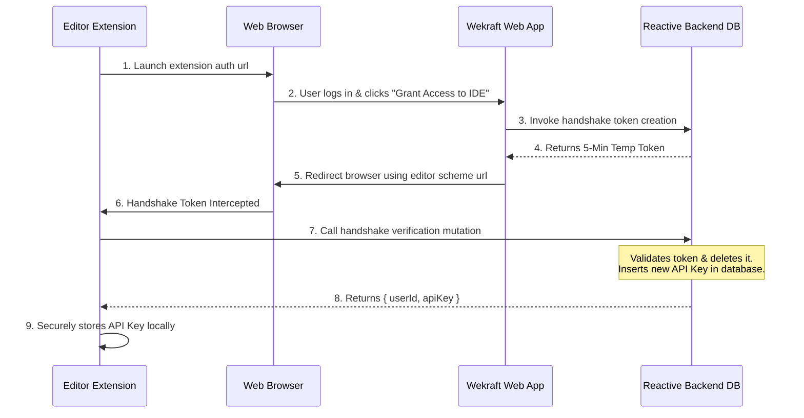

# Editor Extension

The **Wekraft Editor Extension** is the center of our developer-first workspace experience. By embedding backlog tracking, ticket management, and active time logging directly inside your editor, Wekraft reduces the need for developers to switch context between the code editor and web dashboards.

---

## Plan Capabilities & Permissions

Wekraft enforces server-side plan boundaries on all IDE API requests:

- **Free & Plus Tiers (Read-Only Mode)**:
  - Browse projects, active sprints, and assigned tasks in the editor sidebar.
  - View task details, checklists, priorities, and descriptions.
  - Click codebase paths to automatically open target files.
  - *Restricted*: Status updates, task assignments, and time logs must be submitted through the web dashboard.
- **Pro Tier (Full Two-Way Sync)**:
  - Update task and issue statuses directly from the editor sidebar (e.g., transition a task from `Not Started` to `In Progress` or `Completed`).
  - Automatically track active file-focus sessions and sync them to the **Time Logs** timeline.
  - Submit, view, and close service desk tickets directly within the editor.

---

## Handshake Authentication Flow

Wekraft authenticates editor clients securely using a deep-linked handshake protocol that generates a cryptographically signed API key without requiring password exposure:

### Authentication Lifecycle Details:
1. **Initiate**: Select **"Login with Wekraft"** in the editor Activity Bar. This launches the default system browser with the callback redirect parameters.
2. **Authorize**: Authenticated users click **"Grant Access to IDE"** in the browser.
3. **Generate Token**: The web app invokes a database mutation to insert a handshake record with a **5-minute Time-To-Live (TTL)**.
4. **Deep-Link Redirection**: The browser redirects to the custom editor URI scheme.
5. **Exchange**: The editor catches the deep-link parameters and calls the backend endpoint to exchange the token. On success, this generates a permanent key in the api keys table, revokes the handshake token, and returns `{ userId, apiKey }`.

---

## API Security, Rate Limiting & Touch Tracking

Every request issued by the editor extension must authenticate against the internal gateway mutation.

- **Sliding-Window Rate Limiter**:
  - The API key checks usage counts within a sliding **1-minute (60,000ms) window**.
  - **Limit**: Max **60 requests per minute**.
  - Exceeding the threshold returns a rate limit exceeded error, causing the extension to temporarily queue non-critical events.
- **Activity Tracking**:
  - Valid requests touch the database API key record, writing the current epoch time to the last used field for developer security auditing.

---

## Workspace Features in the Editor

### 1. Codebase Navigation
Files linked to tasks or issues via relative paths (e.g. `src/components/Navbar.tsx`) are rendered as active links. Clicking the file link inside the editor instructs it to look up the file in your active workspace directories and open it immediately.

### 2. Time Tracking Sync
If the user belongs to a Pro tier, the extension tracks which files are actively focused in the editor. Focus durations are aggregated and synced periodically back to Wekraft's time tracking metrics.

### 3. Ticket Management
The extension provides access to the service desk backlog, querying tickets and invoking status updates to resolve client requests without leaving the development workspace.
