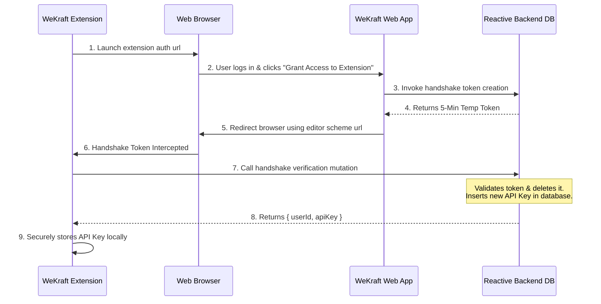

# IDE Extension

The **WeKraft IDE Extension** is the heart of our developer-first workspace experience. It brings your entire WeKraft workspace — backlogs, tasks, sprints, tickets, and time logs — directly into your code editor, so you never have to break your flow or switch context to a browser.

> **Free for Everyone** — The WeKraft Extension is completely free for all users, no plan restrictions. Every WeKraft user gets full extension access.

---

## What You Can Do

### ✅ Project & Sprint Management
- View all your **projects** and their active **sprints** directly in the editor sidebar.
- See sprint progress, start/end dates, and sprint status at a glance.
- Switch between projects without leaving the editor.

### ✅ Task & Issue Tracking
- Browse the full **task and issue backlog** for any project.
- View complete task details including title, description, priority, status, checklists, assignees, labels, and due dates.
- **Update task statuses** directly from the editor (e.g., move a task from `Not Started` → `In Progress` → `Completed`).
- Assign tasks to teammates and update assignees.
- Mark checklist items as complete without opening the browser.

### ✅ Codebase File Navigation
- Tasks and issues linked to specific files (e.g., `src/components/Navbar.tsx`) render as **clickable file links** inside the extension.
- Click a file link to instantly open that file in your active editor workspace — no manual searching.

### ✅ Time Logging
- Log time against tasks and issues directly from the extension.
- View your active and past time log entries per task.
- Track file-focus sessions automatically — when you're actively editing a file linked to a task, the extension aggregates your focus time and syncs it back to WeKraft's **Time Logs** timeline.

### ✅ Service Desk & Ticket Management
- Access your full **service desk ticket backlog** within the editor.
- View open, in-progress, and resolved tickets.
- Update ticket statuses and add notes/responses to client tickets without leaving the development workspace.

### ✅ Notifications & Activity Feed
- Receive real-time updates when tasks are assigned to you or when ticket statuses change.

---

## What You Cannot Do

### ❌ Create New Projects or Sprints
- Project and sprint creation must be done through the **WeKraft web dashboard**. The extension is scoped to viewing and acting on existing work.

### ❌ Manage Workspace Members or Roles
- Inviting members, changing roles, or managing workspace permissions is only available in the **web dashboard settings**.

### ❌ Create New Service Desk Tickets
- Submitting new client support tickets is handled through the web dashboard or client-facing portal. The extension is for managing and resolving existing tickets.

### ❌ Billing & Plan Management
- Subscription, billing, and plan upgrades are accessible only through the **WeKraft web dashboard**.

### ❌ Repository Settings & Integrations
- Connecting or configuring repository integrations (GitHub, GitLab, etc.) is done through the web dashboard. The extension consumes the configured data but cannot modify integration settings.

### ❌ Dashboard Analytics & Reports
- Full analytics dashboards, burndown charts, velocity reports, and team performance insights are available only on the **WeKraft web dashboard**.

---

## Handshake Authentication Flow

WeKraft authenticates extension clients securely using a deep-linked handshake protocol that generates a cryptographically signed API key without requiring password exposure:

### Authentication Lifecycle Details
1. **Initiate**: Select **"Login with WeKraft"** in the extension Activity Bar. This launches your default browser with the callback redirect parameters.
2. **Authorize**: Authenticated users click **"Grant Access to Extension"** in the browser.
3. **Generate Token**: The web app invokes a database mutation to insert a handshake record with a **5-minute Time-To-Live (TTL)**.
4. **Deep-Link Redirection**: The browser redirects to the custom editor URI scheme.
5. **Exchange**: The extension catches the deep-link parameters and calls the backend endpoint to exchange the token. On success, this generates a permanent key in the API keys table, revokes the handshake token, and returns `{ userId, apiKey }`.

---
