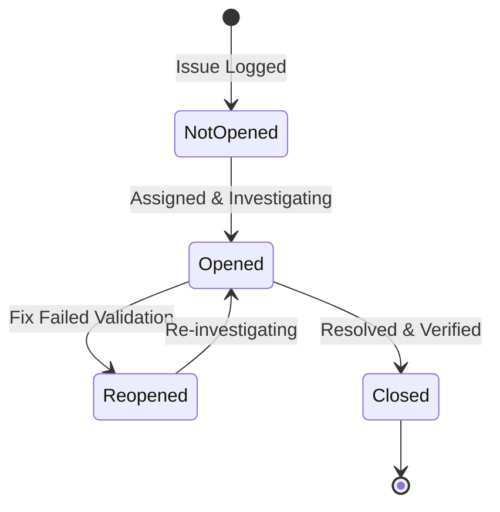

# Issues & Bug Tracking

Issues represent reactive or unplanned work in WeKraft, such as application bugs, server crashes, environment failures, or security hotfixes. They operate outside the planned sprint backlog but can be allocated to sprints for tracking alongside planned tasks.

---

## Issue Properties

Every issue contains the following fields:

- **Title**: A summary detailing the bug report or incident.
- **Description**: Optional details containing steps to reproduce, logs, or system specs.
- **Impact Environment**: Indicates where the issue was detected (such as local, development, staging, or production).
- **Severity**: Dictates the urgency and response priority (Critical, Medium, or Low).
- **File Linked**: Path pointing to the buggy component.
- **Due Date**: Target resolution deadline.
- **Source Type**: Identifies how the issue was ingested (Manual, Task-Issue, or GitHub).

---

## Issue Ingestion Sources (Origins)

WeKraft supports automated and manual issue generation streams:

### 1. Manual Creation
Team members can log bugs at any time by clicking **"New Issue"** inside the workspace issues tab. This prompts a dialog to set the title, description, severity, environment, and due date.

### 2. Task-Issue Blockage Escalation
When a planned backlog task is blocked by a code bug:
- **Trigger**: Click **"Escalate to Issue"** on the task dashboard.
- **Backend Mutation**: This invokes a blockage escalation mutation, setting `isBlocked = true` on the task and creating an issue with `type = "task-issue"`.
- **Assignee Sync**: The new issue automatically inherits all developers assigned to the blocked parent task.
- **Unblocking Flow**: Once the issue status is set to `closed`, a database trigger immediately sets `isBlocked = false` on the parent task, releasing it back to the active workflow.

### 3. Git hosting webhook Synchronisation
If a project is linked to a code repository, issues can be synced automatically:
- **Webhook Endpoint**: WeKraft exposes API routes to catch repository webhook events.
- **Events Tracked**: When an issue is opened, edited, closed, or reopened on the repository hosting provider, the webhook route matches the repository ID to the linked project and mutates WeKraft's datastore.
- **PR Code Integration**: Code pushes and PR merges parse commit messages (e.g., resolving issues by ID) to auto-close corresponding WeKraft issues.

---

## The Issue Lifecycle

Issues transition through the following states:

- **Not Opened (`not opened`)**: Logged in backlog, investigation has not begun.
- **Opened (`opened`)**: Assigned developer is debugging and testing a resolution.
- **Reopened (`reopened`)**: The patch failed staging tests, or the bug recurred in production, reopening the incident.
- **Closed (`closed`)**: The bug is resolved. Closing the issue records the completion timestamp and user ID.
