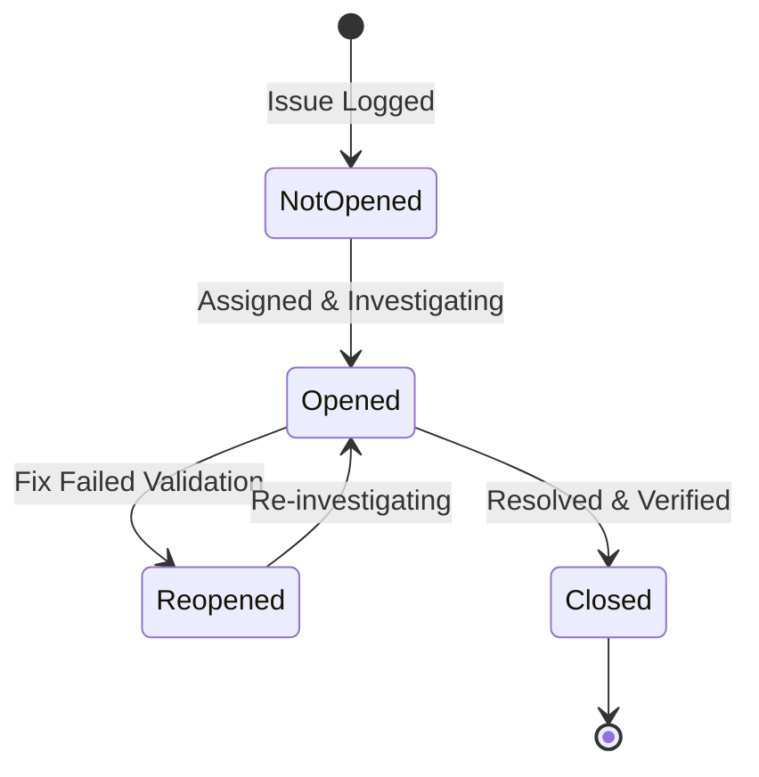

# Issues & Bug Tracking

Issues represent reactive or unplanned work in Wekraft, such as application bugs, server crashes, environment failures, or security hotfixes. They operate outside the planned sprint backlog but can be allocated to sprints for tracking alongside planned tasks.

---

## Issue Document Schema & Properties

Every issue document inside the backend database is defined with the following fields:

- **Title (`title`)**: String detailing the bug report or incident summary.
- **Description (`description`)**: Optional text body containing steps to reproduce, logs, or system specs.
- **Impact Environment (`environment`)**: Indicates where the issue was detected:
  - `local`: Developer workspace error.
  - `dev`: Development build / sandbox server crash.
  - `staging`: Quality assurance / integration testing environment bug.
  - `production`: Incident on the live production build affecting active users.
- **Severity (`severity`)**: Dictates the urgency and response priority:
  - `critical`: Blockers, security vulnerabilities, or database downtime.
  - `medium`: Degraded performance, broken non-critical features.
  - `low`: Minor visual glitches, cosmetic issues, or spelling errors.
- **File Linked (`fileLinked`)**: Path relative to the repository root pointing to the buggy component.
- **Due Date (`due_date`)**: Target resolution deadline. Overdue issues increment the project's **Delay Debt** metric.
- **Source Type (`type`)**: Identifies how the issue was ingested into Wekraft:
  - `manual`: Created through the Wekraft UI.
  - `task-issue`: Created via task escalation.
  - `github`: Synchronized via linked code hosting provider.

---

## Issue Ingestion Sources (Origins)

Wekraft supports automated and manual issue generation streams:

### 1. Manual Creation
Team members can log bugs at any time by clicking **"New Issue"** inside the workspace issues tab. This prompts a dialog to set the title, description, severity, environment, and due date.

### 2. Task-Issue Blockage Escalation
When a planned backlog task is blocked by a code bug:
- **Trigger**: Click **"Escalate to Issue"** on the task dashboard.
- **Backend Mutation**: This invokes a blockage escalation mutation, setting `isBlocked = true` on the task and creating an issue with `type = "task-issue"`.
- **Assignee Sync**: The new issue automatically inherits all developers assigned to the blocked parent task.
- **Unblocking Flow**: Once the issue status is set to `closed`, a database trigger immediately sets `isBlocked = false` on the parent task, releasing it back to the active workflow.

### 3. Git hosting webhook Synchronisation
If a project is linked to a code repository, issues can be synced automatically:
- **Webhook Endpoint**: Wekraft exposes API routes to catch repository webhook events.
- **Events Tracked**: When an issue is opened, edited, closed, or reopened on the repository hosting provider, the webhook route matches the repository ID to the linked project and mutates Wekraft's datastore.
- **PR Code Integration**: Code pushes and PR merges parse commit messages (e.g., resolving issues by ID) to auto-close corresponding Wekraft issues.

---

## The Issue Lifecycle

Issues transition through the following states:



- **Not Opened (`not opened`)**: Logged in backlog, investigation has not begun.
- **Opened (`opened`)**: Assigned developer is debugging and testing a resolution.
- **Reopened (`reopened`)**: The patch failed staging tests, or the bug recurred in production, reopening the incident.
- **Closed (`closed`)**: The bug is resolved. Closing the issue records the completion timestamp and user ID.

---

## Database API Reference (Developer Guide)

Issues are managed via the following backend API endpoints:

### Create Issue
Registers an issue and records assignees in the issue assignees join table.
```typescript
args: {
  title: string,
  description?: string,
  environment?: "local" | "dev" | "staging" | "production",
  severity?: "critical" | "medium" | "low",
  due_date?: number,
  status: "not opened" | "opened" | "reopened" | "closed",
  type: "manual" | "task-issue" | "github",
  githubIssueUrl?: string,
  fileLinked?: string,
  taskId?: Id,
  projectId: Id,
  userId: Id,
  assignees?: Array<{ userId: Id, name: string, avatar?: string }>
}
```

### Update Issue
Updates issue parameters and handles closed status triggers.
```typescript
args: {
  issueId: Id,
  title?: string,
  description?: string,
  status?: "not opened" | "opened" | "reopened" | "closed",
  severity?: "critical" | "medium" | "low",
  environment?: "local" | "dev" | "staging" | "production",
  due_date?: number,
  fileLinked?: string,
  assignees?: Array<{ userId: Id, name: string, avatar?: string }>,
  userId: Id
}
```
*Note: Setting status to `closed` automatically writes completion stats and unblocks any linked task.*

### Delete Issue
Removes the issue document and performs cascading cleanups on assignees and comments.
```typescript
args: {
  issueId: Id,
  userId: Id
}
```
