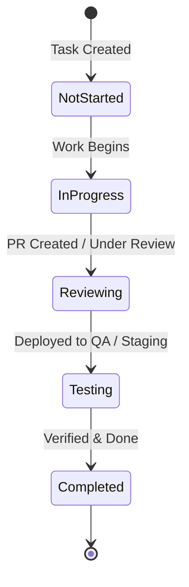

# Tasks & Backlog

Tasks in Wekraft are the primary planning units used to organize product backlogs, map engineering work, and execute sprint goals. This document provides a detailed reference of task properties, lifecycles, and database integration rules.

---

## Task Properties

Every task contains the following properties:

- **Title**: A description of the work to be done.
- **Description**: Optional details about the requirements or checklist items.
- **Priority**: Urgency classifications set as High, Medium, or Low.
- **Status**: The workflow state representing the phase of execution (see Lifecycle).
- **Estimation**: The planned start and end dates for the task.
- **Is Blocked**: An indicator showing whether the task is blocked by an open issue.
- **Codebase Link**: Optional reference to a repository file.
- **Sprint Association**: Optional reference pointing to a time-boxed sprint.
- **Attachments**: Optional files or assets uploaded to the task.

---

## Task Workflow & Lifecycle

Tasks move through a standard linear state machine. Status updates trigger automatic database recalculations, including developer workloads and active sprint burn rates.

1. **Not Started (`not started`)**: Task is parked in the backlog or active sprint.
2. **In Progress (`inprogress`)**: A developer has accepted the task and is actively writing code.
3. **Reviewing (`reviewing`)**: Development is complete; work is awaiting pull request approval or peer reviews.
4. **Testing (`testing`)**: The feature has been built and is undergoing validation on dev or staging builds.
5. **Completed (`completed`)**: The task is fully delivered. Marking completion sets the completion timestamp and logs the resolver's user ID.

---

## Workspace Layout Views

Wekraft renders the active sprint board and project backlog across three distinct layouts:

- **List View**: A dense spreadsheet-style table. Designed for project managers to quickly scan, bulk-edit priority labels, edit dates, and drag items directly into active sprints.
- **Board View (Kanban)**: A column-based visual layout mapped to task status. Team members can drag-and-drop cards between columns to mutate task status instantly. Dragging cards triggers real-time backend mutations that update all viewing clients.
- **Table View**: A structured grid view designed to display assignees, estimation dates, and codebase links side-by-side.

---

## Codebase Linking & Editor Integration

If a task contains a `linkWithCodebase` filepath, developers can navigate directly from the browser dashboard to the exact line of code in their editor:

1. **Focus Click**: Inside the Kanban card or the Table row, click the codebase link/icon.
2. **Handshake Verification**: The browser verifies the active API key through the local editor extension handshake.
3. **Editor Focus**: The local code editor receives the file focus command and automatically opens the file from the workspace root, matching the relative path.

---

## Blocking & Task-Issue Escalation

When a task encounters an unexpected barrier (such as a dependency block or critical bug), developers can escalate the task:

- **Trigger**: Click the **"Escalate to Issue"** action on the task details sheet.
- **Behavior**: This initiates a blockage escalation mutation. It sets `isBlocked` to `true` on the task and inserts a new incident in the issues database linked back to the task.
- **Resolution**: The task is locked in a read-only state. Once the linked issue is fixed and marked as `closed`, a database mutation automatically resets `isBlocked` to `false`, freeing the task for completion.
