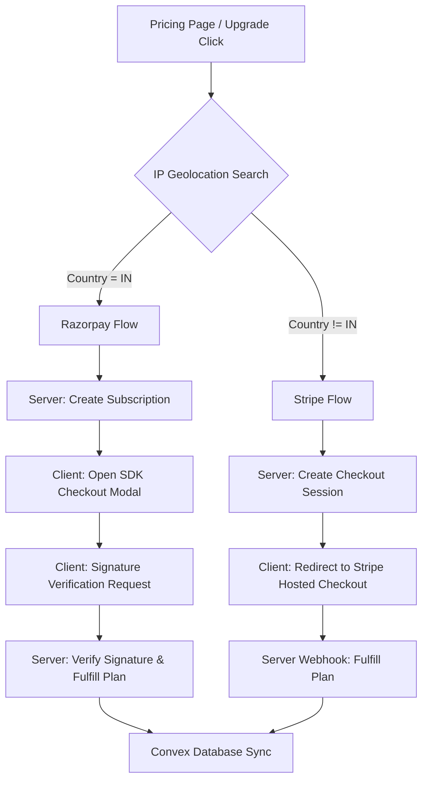

# Wekraft SaaS: Payment Integration & Webhook Guide

This comprehensive reference document details the architecture, configuration, testing procedures, and environment variables for the dual-payment integration (**Stripe** and **Razorpay**) inside Wekraft SaaS.

---

## 1. High-Level Architecture Overview

Wekraft uses a dynamic, location-based payment routing engine. This architecture handles global cards via **Stripe** while routing Indian transactions through **Razorpay** to fully support local card mandates and UPI payment structures.



### Key Technical Decisions
1. **Server-Side Pricing Control:** All plans, amounts, and metadata are validated and configured on the server. The client cannot send custom pricing to prevent tampering.
2. **Graceful Cancellations (No Instant Downgrades):** When users cancel, their premium plans remain active (`"pro"` or `"plus"`) with `cancelAtPeriodEnd: true` in Convex until their paid billing period (`currentPeriodEnd`) terminates. Downgrades to `"free"` occur asynchronously at the end of the term.
3. **Webhook Security:** Signature verification is performed on all webhook entry points using `crypto.timingSafeEqual` (Razorpay) and `stripe.webhooks.constructEvent` (Stripe) to prevent spoofing.

---

## 2. Dynamic Location-Based Routing

The entry point for payment selection resides in the frontend Pricing Component:
* **IP Lookup API:** Hits `https://ipapi.co/json/` to fetch the client's current country code on page load.
* **Condition:** If `country_code === "IN"`, payments route to the `useRazorpay()` hook. Otherwise, they route to the `useStripeCheckout()` hook.

---

## 3. Stripe Integration Breakdown

Stripe is integrated completely server-side, utilizing Stripe's hosted **Checkout Sessions** and the **Customer Billing Portal**.

### A. Stripe Keys Acquisition Setup
To set up Stripe, log into your [Stripe Dashboard](https://dashboard.stripe.com/) (or use Test Mode) and obtain:
1. **`NEXT_PUBLIC_STRIPE_PUBLISHABLE_KEY` / `STRIPE_SECRET_KEY`:** Available under **Developers > API Keys**.
2. **`STRIPE_PLUS_PRICE_ID` / `STRIPE_PRO_PRICE_ID`:**
   * Go to **Product Catalog** and click **Add Product**.
   * Create "Plus" ($7/mo) and "Pro" ($15/mo) as recurring monthly products.
   * Copy the price IDs starting with `price_...` and set them in your environment variables.
3. **`STRIPE_SUCCESS_URL` / `STRIPE_CANCEL_URL`:** Define where users are redirected after checkout completes or is abandoned.

### B. Local Webhook Testing (CLI Commands)
To test Stripe Webhooks locally without deploying the app, install the **Stripe CLI** and execute:

```bash
# 1. Login to your Stripe account via CLI
stripe login

# 2. Forward Stripe webhook events to your local API route
stripe listen --forward-to localhost:3000/api/payments/stripe/webhook
```

Upon starting, the CLI will output a webhook signing secret (starts with `whsec_...`). Copy this and set it as `STRIPE_WEBHOOK_SECRET` in your `.env.local`.

### C. Live Production Webhook Configuration
1. Go to **Developers > Webhooks** in the Stripe Dashboard.
2. Click **Add Endpoint** and set the URL to: `https://yourdomain.com/api/payments/stripe/webhook`.
3. Select the following **Events to send**:
   * `checkout.session.completed` (handles initial payment fulfillment)
   * `customer.subscription.updated` (handles updates like scheduled cancellations or changes)
   * `customer.subscription.deleted` (handles downgrades once the billing term ends)
4. Copy the Signing Secret generated by Stripe and save it as `STRIPE_WEBHOOK_SECRET` in your production environment variables.

---

## 4. Razorpay Integration Breakdown

Razorpay uses a hybrid flow where a subscription object is generated on the server, processed on the client via the Razorpay Web checkout SDK, and verified securely back on the server.

### A. Razorpay Keys Acquisition Setup
Log into your [Razorpay Dashboard](https://dashboard.razorpay.com/) and follow these steps:
1. **`NEXT_PUBLIC_RAZORPAY_KEY_ID` / `RAZORPAY_KEY_SECRET`:** 
   * Navigate to **Account & Settings > API Keys (Key Id & Secret Key)**.
   * Generate test or live keys.
2. **`RAZORPAY_PLUS_PLAN_ID` / `RAZORPAY_PRO_PLAN_ID`:**
   * Go to **Subscriptions > Plans**.
   * Click **Create Plan**, define the name, pricing description, and interval (monthly).
   * Copy the plan IDs (e.g., `plan_...`) and configure them in your environment.

### B. Local Webhook Testing (ngrok Setup)
Because Razorpay does not have a CLI to forward webhook events directly, you must expose your localhost to the internet using a tool like **ngrok**:

```bash
# Expose your local Next.js server (port 3000) to the internet
ngrok http 3000
```

1. Copy the secure HTTPS URL provided by ngrok (e.g., `https://xxxx-xx.ngrok-free.app`).
2. Go to your **Razorpay Dashboard > Settings > Webhooks > Add New Webhook**.
3. Set the Webhook URL to: `https://xxxx-xx.ngrok-free.app/api/payments/razorpay/webhook`.
4. Define a custom **Webhook Secret** (e.g., `wk_rzp_webhook_secret_2026_xYz`) and set it as `RAZORPAY_WEBHOOK_SECRET` in your `.env.local`.
5. Select the following **Active Events**:
   * `subscription.charged`
   * `subscription.cancelled`
   * `subscription.halted`
   * `subscription.paused`
   * `subscription.resumed`

### C. Live Production Webhook Configuration
Once in production, update the Webhook URL in your Razorpay Dashboard Settings to point directly to your live production server API endpoint:
`https://yourdomain.com/api/payments/razorpay/webhook`.

---

## 5. Convex Database Architecture & Updates

Both payment integrations feed into a single unified schema in Convex ([convex/schema.ts](file:///e:/wekraft-saas/convex/schema.ts)).

### A. User Document Schema
```typescript
users: defineTable({
  // ...other user fields...
  accountType: v.union(v.literal("free"), v.literal("plus"), v.literal("pro")),
  
  // Subscription Data
  subscriptionId: v.optional(v.string()),       // Stripe sub_... or Razorpay sub_...
  customerId: v.optional(v.string()),           // Stripe cus_...
  subscriptionStatus: v.optional(v.string()),   // "active", "cancelled", "past_due", etc.
  subscriptionProvider: v.optional(v.string()), // "stripe" | "razorpay"
  currentPeriodEnd: v.optional(v.number()),     // Unix timestamp in ms
  cancelAtPeriodEnd: v.optional(v.boolean()),   // True if scheduled to cancel at end of cycle
})
.index("by_subscriptionId", ["subscriptionId"])
.index("by_customerId", ["customerId"])
```

### B. Cancellation Grace Period Processing Flow

#### Stripe
* When a user cancels via the billing portal, Stripe immediately triggers `customer.subscription.updated`.
* The server calls `api.stripe.handleSubscriptionUpdate` in Convex. Because the status remains `"active"`, the user's plan is not touched. `cancelAtPeriodEnd` is updated to `true`, and the exact `currentPeriodEnd` is saved.
* When the cycle ends, Stripe triggers `customer.subscription.deleted`. The webhook sets the user's status to `"canceled"` and upgrades/downgrades their `accountType` to `"free"`.

#### Razorpay
* When a user cancels, Wekraft hits the server route [/api/payments/razorpay/cancel](file:///e:/wekraft-saas/src/app/api/payments/razorpay/cancel/route.ts), which runs:
  ```typescript
  // Schedules cancellation at the end of the paid cycle, instead of immediately
  await razorpay.subscriptions.cancel(subscriptionId, true);
  ```
* The server instantly calls `api.razorpay.handleSubscriptionUpdate` to mark `cancelAtPeriodEnd: true` and `subscriptionStatus: "active"` so the UI displays the cancellation warning immediately.
* Once the current cycle ends, Razorpay fires a `subscription.cancelled` webhook event. The webhook catches this, calls the mutation, and downgrades the user's plan to `"free"`.

---

## 6. Complete Environment Variable Reference

Add these keys to your `.env.local` (local development) and your production host provider (Vercel/Convex).

| Variable Name | Required For | Source | Example Value / Format |
| :--- | :--- | :--- | :--- |
| **Razorpay Settings** | | | |
| `NEXT_PUBLIC_RAZORPAY_KEY_ID` | Client SDK & Verify Route | Razorpay API Keys | `rzp_test_Sq5ia9B61kaxHl` |
| `RAZORPAY_KEY_SECRET` | Verify & Cancel Server Routes | Razorpay API Keys | `19j7miNOVe0mUBTg4f32pf1q` |
| `RAZORPAY_PLUS_PLAN_ID` | Razorpay Subscription Route | Razorpay Subscription Plans | `plan_placeholder_plus` |
| `RAZORPAY_PRO_PLAN_ID` | Razorpay Subscription Route | Razorpay Subscription Plans | `plan_placeholder_pro` |
| `RAZORPAY_WEBHOOK_SECRET` | Razorpay Webhook Verifier | Custom Defined in Webhook Settings | `wk_rzp_webhook_secret_2026_xYz` |
| **Stripe Settings** | | | |
| `NEXT_PUBLIC_STRIPE_PUBLISHABLE_KEY`| *(Optional / Keep for reference)* | Stripe Developers API Keys | `pk_test_...` |
| `STRIPE_SECRET_KEY` | Stripe Server APIs | Stripe Developers API Keys | `sk_test_...` |
| `STRIPE_WEBHOOK_SECRET` | Stripe Webhook Verifier | Stripe CLI or Webhooks Settings | `whsec_...` |
| `STRIPE_SUCCESS_URL` | Stripe Redirect Target | Next.js App Base URL | `http://localhost:3000/dashboard` |
| `STRIPE_CANCEL_URL` | Stripe Redirect Target | Next.js App Base URL | `http://localhost:3000/web/pricing` |
| `STRIPE_PLUS_PRICE_ID` | Stripe Checkout Route | Stripe Products Catalog | `price_placeholder_plus` |
| `STRIPE_PRO_PRICE_ID` | Stripe Checkout Route | Stripe Products Catalog | `price_placeholder_pro` |
| **General Settings** | | | |
| `BACKEND_SECRET` | Server-to-Convex API Security | Generated 32-byte Hex String | `38cc7ceacbe7b3ed5ec91939...` |

---

## 7. Upgrading & Adding New Plans (Future Expansion Guide)

If you need to add a new tier in the future (e.g., an "Enterprise" or "Plus Extra" plan):

1. **Add Tier in database schema:** If a new keyword is needed, edit `convex/schema.ts` to allow it in `accountType` (e.g., `v.literal("enterprise")`).
2. **Configure Products & IDs:** 
   * Create the product in Stripe and obtain the new Price ID. Set `STRIPE_ENTERPRISE_PRICE_ID` in `.env.local`.
   * Create the plan in Razorpay and obtain the Plan ID. Set `RAZORPAY_ENTERPRISE_PLAN_ID` in `.env.local`.
3. **Update API Routes:**
   * Update [stripe/checkout/route.ts](file:///e:/wekraft-saas/src/app/api/payments/stripe/checkout/route.ts) to resolve `planType === "enterprise"` to your new price ID.
   * Update [razorpay/subscription/route.ts](file:///e:/wekraft-saas/src/app/api/payments/razorpay/subscription/route.ts) to resolve `planType === "enterprise"` to your new Razorpay plan ID.
4. **Update Frontend UI:** Edit [Pricing.tsx](file:///e:/wekraft-saas/src/modules/web/Pricing.tsx) to add the new plan details under the `plans` list array:
   ```typescript
   {
     key: "enterprise",
     name: "Enterprise",
     priceLabel: "$49",
     description: "For scaling organizations",
     cta: "Get Enterprise",
     priceUSD: 49,
     // ...
   }
   ```
